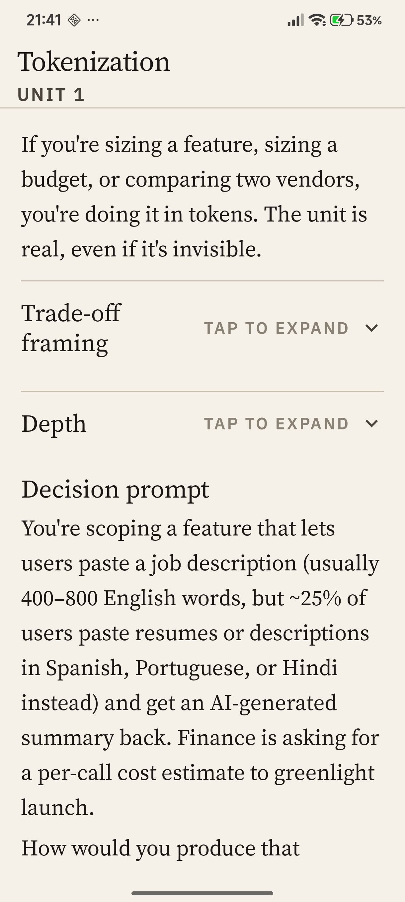

<p align="center">
  <picture>
    <source media="(prefers-color-scheme: dark)" srcset="docs/brand/perpenda-wordmark-dark.svg">
    
  </picture>
</p>

<h3 align="center">Decision-grade fluency in LLM systems<br>for senior product managers.</h3>

<p align="center">
  Twenty units, in order, each one a single trade-off.<br>
  Decision prompts, per-criterion calibrated grading, spaced review.<br>
  <em>Not a tutorial app.</em>
</p>

<p align="center">
  <a href="https://github.com/LuminLynx/Perpenda/releases/latest"></a>
  <a href="https://perpenda.com"></a>
  <a href="https://perpenda.com/legal/privacy-policy.html"></a>
  <a href="LICENSE"></a>
</p>

<p align="center">
  <a href="https://github.com/LuminLynx/Perpenda/releases/download/V1.0/app-release.apk"></a>
</p>

<p align="center">
  <picture>
    <source media="(prefers-color-scheme: dark)" srcset="docs/app-store/screens-dark/02-unit-reader.png">
    
  </picture>
</p>

---

## Install

Sideload the signed APK directly. Google Play Protect verifies on install. The in-app banner surfaces when a new version is available.

- **[Download v1.0 APK](https://github.com/LuminLynx/Perpenda/releases/download/V1.0/app-release.apk)** · 7.1 MB · Android 8.0 (API 26)+
- **[SHA-256 fingerprint](https://github.com/LuminLynx/Perpenda/releases/download/V1.0/app-release.apk.sha256)** for verification
- Full install instructions: **[perpenda.com/#download](https://perpenda.com/#download)**

---

## Product vision

Perpenda helps product professionals become AI-fluent enough to lead the decisions their teams now have to make.

The intended audience is product-side professionals with real stakes in AI literacy:

- Product managers
- Product marketing managers
- Founders
- Design leads
- Business-development leads
- Executives and product-adjacent decision-makers

The goal is **decision-grade competence**: enough fluency to make build / buy / skip decisions, talk credibly with engineers, and recognize trade-offs and failure modes in AI-backed products.

Perpenda is not a math-first ML course, a code-first engineering curriculum, a glossary-first reference app, or a hype-feed about AI news.

---

## Current release

**v1.0 — sideload distribution.** The first public build shipped 1 June 2026 with fifteen of twenty units, the calibrated grader, and spaced review. The APK is hosted on [GitHub Releases](https://github.com/LuminLynx/Perpenda/releases) and linked from [perpenda.com/#download](https://perpenda.com/#download); the app surfaces an in-app banner when a new version is available.

What v1.0 ships:

- Fifteen units across the LLM-systems curriculum (tokenization through safety + content moderation).
- Per-criterion calibrated grading on every decision prompt — no holistic score.
- Spaced review on completed units.
- Cross-device progress sync once signed in.

Held back, planned for follow-up releases:

- Units 16–20 — the operating-phase units (monitoring, vendor risk, A/B, fallbacks). Placeholders exist in the path; authored content lands as real-use signal decides which production topics matter most.
- F6 Path Overview.
- Google Play distribution. v1.0 is sideload-only by deliberate choice; Play submission is a separate future decision.

Canonical status docs:

- `docs/strategy/STRATEGY.md` — product strategy and locked decisions.
- `docs/roadmap/EXECUTION.md` — phase plan and sequencing.
- `docs/roadmap/PHASE_3_4_ROADMAP.md` — Phase 3 / Phase 4 roadmap (historical at this point).
- `docs/curriculum/v1-path-outline.md` — the canonical 20-unit path outline.

---

## Core learning loop

The app is organized around a path, not a catalog.

The intended session loop is:

1. **Continue** — open the app and see the next unit in the path.
2. **Bite** — read a short, trade-off-first explanation.
3. **Decide** — answer an open-ended decision prompt.
4. **Calibrate** — see how the answer maps to a rubric, sources, and confidence.
5. **Progress** — complete the unit and advance through the path.
6. **Return** — revisit older units through spaced review.

The glossary exists as supporting reference material, not as the primary product surface.

---

## v1 path: LLM Systems for PMs

The canonical v1 path is **LLM Systems for PMs**.

The path is designed to teach product professionals how to reason about LLM-backed products through concrete product trade-offs.

Published units (1–15):

1. Tokenization
2. Context Window
3. Latency
4. Evals
5. Model selection
6. Prompt design basics
7. Hallucination + reliability
8. Cost dynamics at scale
9. Fine-tuning vs. prompting vs. RAG
10. Vector search / RAG fundamentals
11. Streaming UX
12. Tool use / function calling
13. Multimodal (vision basics)
14. Agents / multi-step reasoning
15. Safety + content moderation

Locked / planned units:

16–20. Operating-phase units, to be locked from real-user signal

See `docs/curriculum/v1-path-outline.md` for the maintained source of truth.

---

## Product principles

Perpenda is guided by five product principles:

1. **Decisions before mechanism** — teach what to do with a concept before diving into how it works.
2. **Calibrate, don't bluff** — claims should be sourced, confidence-tagged, and honest about uncertainty.
3. **Path, not catalog** — the home experience is continuing the learning path, not browsing a glossary.
4. **Bite first, depth on tap** — every unit should be understandable quickly, with depth available when needed.
5. **Quality ceiling, not content scale** — better to ship fewer excellent units than many mediocre ones.

The primary wedge is the combination of trade-off-first pedagogy and calibrated reliability.

---

## Architecture

The repo contains an Android client, a FastAPI backend, PostgreSQL migrations, authored curriculum content, regression sets, and project documentation.

### Android

- Kotlin
- Jetpack Compose
- Material 3
- JWT-backed auth state
- Encrypted token storage
- Path home, unit reader, auth, settings, and supporting glossary surfaces

### Backend

- FastAPI
- PostgreSQL
- psycopg
- JWT auth
- Migration runner
- Path / unit / completion APIs
- LLM grading service
- Regression-set discipline for grader calibration

### Deployment / operations

- Railway-oriented backend deployment
- Production config validation through `APP_ENV=production`
- PostgreSQL migration discipline
- Prompt-caching strategy for grader unit economics

Backend decisions are documented in `docs/guides/BACKEND_BEST_PRACTICES.md`.
Android decisions are documented in `docs/guides/ANDROID_BEST_PRACTICES.md`.

---

## Repository structure

```text
app/                         Android client
backend/                     FastAPI backend, migrations, scripts, tests
content/units/               Authored learning units
content/regression-sets/     Ground-truth answer/grade regression sets
docs/                        Canonical strategy, execution, audit, and roadmap docs
gradle/                      Android Gradle wrapper files
scripts/                     Project utility scripts
```

Important docs:

```text
docs/strategy/STRATEGY.md                Product strategy
docs/roadmap/EXECUTION.md                Phase plan
docs/audits/AUDIT.md                     Phase 0 cleanup audit and keep/reshape/delete map
docs/roadmap/PHASE_3_4_ROADMAP.md        Phase 3/4 roadmap
docs/guides/ANDROID_BEST_PRACTICES.md    Android implementation decisions
docs/guides/BACKEND_BEST_PRACTICES.md    Backend implementation decisions
docs/curriculum/v1-path-outline.md       Canonical v1 unit sequence
```

---

## Local development

This section is intentionally minimal until the setup flow is stabilized.

### Backend

Typical backend workflow:

```bash
python3 -m venv .venv
source .venv/bin/activate
pip install -r backend/requirements.txt
python3 -m backend.scripts.migrate
python3 -m backend.scripts.seed_db
uvicorn backend.app.main:app --host 0.0.0.0 --port 8000
```

Environment variables are expected for production-like runs, especially:

```text
DATABASE_URL
JWT_SECRET
AI_PROVIDER_API_KEY
APP_ENV
```

Production deployments should set `APP_ENV=production` so weak defaults are rejected at startup.

### Android

Typical Android workflow:

```bash
./gradlew assembleDebug
```

The app is developed in Android Studio and currently targets Android-first v1 development.

---

## Grader and calibration discipline

The product's credibility depends on the grader being trustworthy.

Each published unit is expected to ship with a ground-truth regression set. The grader is evaluated against authored expected outcomes before a unit is considered published.

The grading model is per-criterion, not holistic. The intended user-facing behavior is:

- show which criteria were met or not met;
- expose confidence;
- flag uncertain answers instead of pretending certainty;
- ground grading in the unit content, sources, rubric, and quoted user answer text.

This is part of the product's reliability moat, not an optional test harness.

---

## Legacy / transition notes

Some old glossary-oriented features were intentionally demoted or removed as the product moved from its FOSS-101 / AI-101 origins to Perpenda.

Examples of legacy or demoted surfaces:

- Browse / Categories / Search as primary navigation
- Ask Glossary as a front door
- Term Draft contribution flows
- AI Learning Layer style-picker flows
- Glossary-first home screen patterns

The current source of truth for what survives, changes, or gets removed is `docs/audits/AUDIT.md`.

---

## License

This project is licensed under the **GNU General Public License v3.0**.

See `LICENSE` for the full license text.
